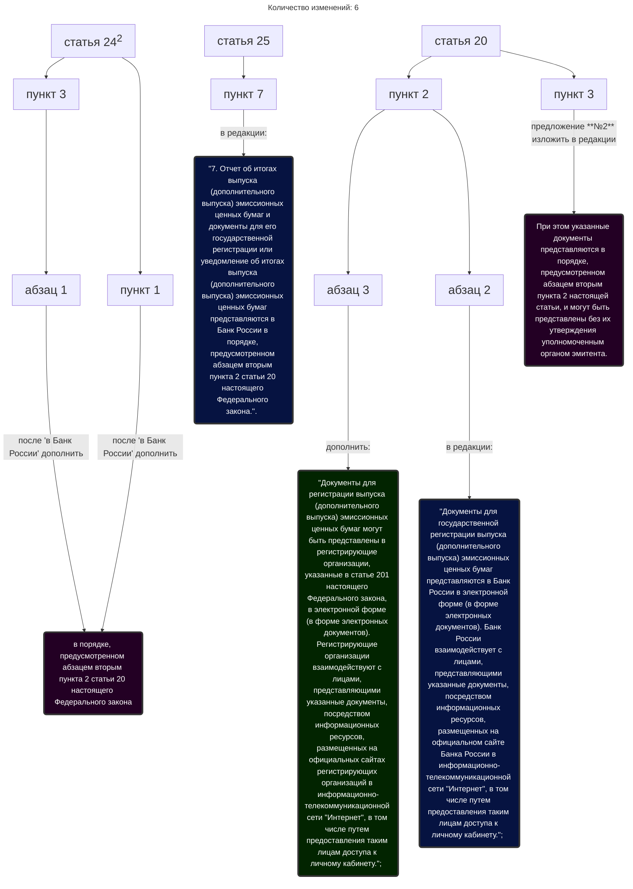

Библиотека для парсинга изменяющих документов, пока тестируется, можно создать граф изменений в виде диаграмы:

```mermaid
---
title: "Количество изменений: 6"
---
%%{init: { "themeVariables": {"fontSize": "20px"} } }%%
flowchart TD
5789347710849047716:::node@{ shape: rect, label: "статья 24<sup>2</sup>"}
3565391270261261817:::node@{ shape: rect, label: "статья 20"}
14901943633444308844:::node@{ shape: rect, label: "статья 25"}
6997219601169200219:::node@{ shape: rect, label: "пункт 3"}
8226247985376750520:::node@{ shape: rect, label: "пункт 1"}
8226247985376750520-->|после 'в Банк России' дополнить|2494442279054025032:::words@{ shape: rounded, label: "в порядке, предусмотренном абзацем вторым пункта 2 статьи 20 настоящего Федерального закона"}
9848673957220412147:::node@{ shape: rect, label: "пункт 2"}
16143883374197144674:::node@{ shape: rect, label: "пункт 3"}
16143883374197144674-->|предложение **№2** изложить в редакции|17626846293703038567:::words@{ shape: rounded, label: "При этом указанные документы представляются в порядке, предусмотренном абзацем вторым пункта 2 настоящей статьи, и могут быть представлены без их утверждения уполномоченным органом эмитента."}
7764664368912257084:::node@{ shape: rect, label: "пункт 7"}
7764664368912257084-->| в редакции: |511180792670623302:::replace@{ shape: rounded, label: "\"7. Отчет об итогах выпуска (дополнительного выпуска) эмиссионных ценных бумаг и документы для его государственной регистрации или уведомление об итогах выпуска (дополнительного выпуска) эмиссионных ценных бумаг представляются в Банк России в порядке, предусмотренном абзацем вторым пункта 2 статьи 20 настоящего Федерального закона.\".  "}
5597613885198291469:::node@{ shape: rect, label: "абзац 1"}
5597613885198291469-->|после 'в Банк России' дополнить|2494442279054025032:::words@{ shape: rounded, label: "в порядке, предусмотренном абзацем вторым пункта 2 статьи 20 настоящего Федерального закона"}
5835380115315909074:::node@{ shape: rect, label: "абзац 3"}
5835380115315909074-->| дополнить: |51766117061425601:::apply@{ shape: rounded, label: "\"Документы для регистрации выпуска (дополнительного выпуска) эмиссионных ценных бумаг могут быть представлены в регистрирующие организации, указанные в статье 201 настоящего Федерального закона, в электронной форме (в форме электронных документов). Регистрирующие организации взаимодействуют с лицами, представляющими указанные документы, посредством информационных ресурсов, размещенных на официальных сайтах регистрирующих организаций в информационно-телекоммуникационной сети \"Интернет\", в том числе путем предоставления таким лицам доступа к личному кабинету.\";  "}
7043015201645621386:::node@{ shape: rect, label: "абзац 2"}
7043015201645621386-->| в редакции: |3558478970180451071:::replace@{ shape: rounded, label: "\"Документы для государственной регистрации выпуска (дополнительного выпуска) эмиссионных ценных бумаг представляются в Банк России в электронной форме (в форме электронных документов). Банк России взаимодействует с лицами, представляющими указанные документы, посредством информационных ресурсов, размещенных на официальном сайте Банка России в информационно-телекоммуникационной сети \"Интернет\", в том числе путем предоставления таким лицам доступа к личному кабинету.\";  "}
5789347710849047716-->6997219601169200219
5789347710849047716-->8226247985376750520
3565391270261261817-->9848673957220412147
3565391270261261817-->16143883374197144674
14901943633444308844-->7764664368912257084
6997219601169200219-->5597613885198291469
9848673957220412147-->5835380115315909074
9848673957220412147-->7043015201645621386

classDef replace fill:#061341,stroke:#333,stroke-width:4px,color:white,font-size:18px
classDef apply fill:#022400,stroke:#333,stroke-width:4px,color:white,font-size:18px
classDef words fill:#230024,stroke:#333,stroke-width:4px,color:white,font-size:18px
classDef node font-size:28px
```
