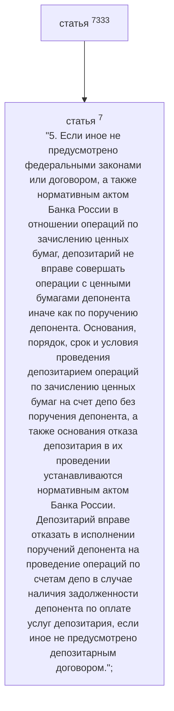

```mermaid
flowchart TD
  A@{ shape: rect, label: "статья <sup>7333</sup>" } ---> 1979050971250297935@{ shape: rect, label: "статья <sup>7</sup>
    \"5. Если иное не предусмотрено федеральными законами или договором, а также нормативным актом Банка России в отношении операций по зачислению ценных бумаг, депозитарий не вправе совершать операции с ценными бумагами депонента иначе как по поручению депонента. Основания, порядок, срок и условия проведения депозитарием операций по зачислению ценных бумаг на счет депо без поручения депонента, а также основания отказа депозитария в их проведении устанавливаются нормативным актом Банка России. Депозитарий вправе отказать в исполнении поручений депонента на проведение операций по счетам депо в случае наличия задолженности депонента по оплате услуг депозитария, если иное не предусмотрено депозитарным договором.\";"}
```