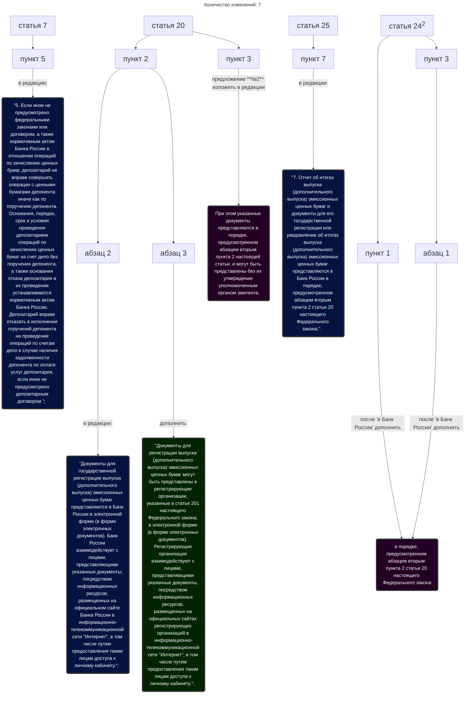

```mermaid
---
title: "Количество изменений: 7"
---
%%{init: { "themeVariables": {"fontSize": "20px"} } }%%
flowchart TD
11201133191322766102:::node@{ shape: rect, label: "статья 7"}
13997282218202420871:::node@{ shape: rect, label: "статья 20"}
3980771763636016481:::node@{ shape: rect, label: "статья 24<sup>2</sup>"}
3712320900554505087:::node@{ shape: rect, label: "статья 25"}
16700693511141118761:::node@{ shape: rect, label: "пункт 5"}
16700693511141118761-->| в редакции: |1599584363639125082:::replace@{ shape: rounded, label: "\"5. Если иное не предусмотрено федеральными законами или договором, а также нормативным актом Банка России в отношении операций по зачислению ценных бумаг, депозитарий не вправе совершать операции с ценными бумагами депонента иначе как по поручению депонента. Основания, порядок, срок и условия проведения депозитарием операций по зачислению ценных бумаг на счет депо без поручения депонента, а также основания отказа депозитария в их проведении устанавливаются нормативным актом Банка России. Депозитарий вправе отказать в исполнении поручений депонента на проведение операций по счетам депо в случае наличия задолженности депонента по оплате услуг депозитария, если иное не предусмотрено депозитарным договором.\";  "}
10848941046689315980:::node@{ shape: rect, label: "пункт 2"}
5051334021147667728:::node@{ shape: rect, label: "пункт 3"}
5051334021147667728-->|предложение **№2** изложить в редакции|17626846293703038567:::words@{ shape: rounded, label: "При этом указанные документы представляются в порядке, предусмотренном абзацем вторым пункта 2 настоящей статьи, и могут быть представлены без их утверждения уполномоченным органом эмитента."}
12610378552065425317:::node@{ shape: rect, label: "пункт 1"}
12610378552065425317-->|после 'в Банк России' дополнить|2494442279054025032:::words@{ shape: rounded, label: "в порядке, предусмотренном абзацем вторым пункта 2 статьи 20 настоящего Федерального закона"}
18336620623497940775:::node@{ shape: rect, label: "пункт 3"}
13672234735859806597:::node@{ shape: rect, label: "пункт 7"}
13672234735859806597-->| в редакции: |18046168896231210700:::replace@{ shape: rounded, label: "\"7. Отчет об итогах выпуска (дополнительного выпуска) эмиссионных ценных бумаг и документы для его государственной регистрации или уведомление об итогах выпуска (дополнительного выпуска) эмиссионных ценных бумаг представляются в Банк России в порядке, предусмотренном абзацем вторым пункта 2 статьи 20 настоящего Федерального закона.\".  "}
2641608901213001052:::node@{ shape: rect, label: "абзац 2"}
2641608901213001052-->| в редакции: |3558478970180451071:::replace@{ shape: rounded, label: "\"Документы для государственной регистрации выпуска (дополнительного выпуска) эмиссионных ценных бумаг представляются в Банк России в электронной форме (в форме электронных документов). Банк России взаимодействует с лицами, представляющими указанные документы, посредством информационных ресурсов, размещенных на официальном сайте Банка России в информационно-телекоммуникационной сети \"Интернет\", в том числе путем предоставления таким лицам доступа к личному кабинету.\";  "}
8341360813713097682:::node@{ shape: rect, label: "абзац 3"}
8341360813713097682-->| дополнить: |51766117061425601:::apply@{ shape: rounded, label: "\"Документы для регистрации выпуска (дополнительного выпуска) эмиссионных ценных бумаг могут быть представлены в регистрирующие организации, указанные в статье 201 настоящего Федерального закона, в электронной форме (в форме электронных документов). Регистрирующие организации взаимодействуют с лицами, представляющими указанные документы, посредством информационных ресурсов, размещенных на официальных сайтах регистрирующих организаций в информационно-телекоммуникационной сети \"Интернет\", в том числе путем предоставления таким лицам доступа к личному кабинету.\";  "}
2356889896095377460:::node@{ shape: rect, label: "абзац 1"}
2356889896095377460-->|после 'в Банк России' дополнить|2494442279054025032:::words@{ shape: rounded, label: "в порядке, предусмотренном абзацем вторым пункта 2 статьи 20 настоящего Федерального закона"}
11201133191322766102-->16700693511141118761
13997282218202420871-->10848941046689315980
13997282218202420871-->5051334021147667728
3980771763636016481-->12610378552065425317
3980771763636016481-->18336620623497940775
3712320900554505087-->13672234735859806597
10848941046689315980-->2641608901213001052
10848941046689315980-->8341360813713097682
18336620623497940775-->2356889896095377460

classDef replace fill:#061341,stroke:#333,stroke-width:4px,color:white,font-size:18px
classDef apply fill:#022400,stroke:#333,stroke-width:4px,color:white,font-size:18px
classDef words fill:#230024,stroke:#333,stroke-width:4px,color:white,font-size:18px
classDef node font-size:28px
```