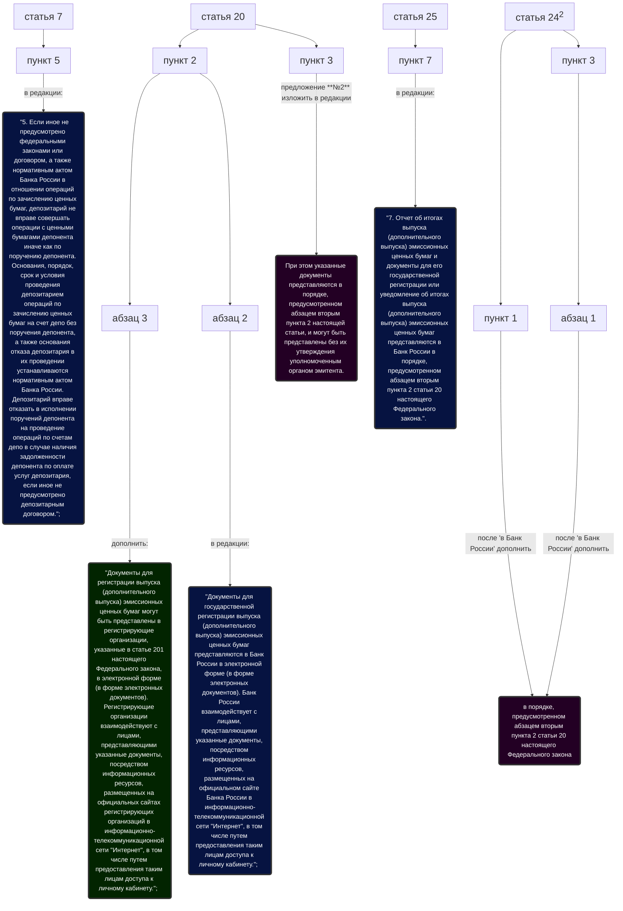

```mermaid
%%{init: { "themeVariables": {"fontSize": "20px"} } }%%
flowchart TD
1979050971250297935:::path@{ shape: rect, label: "статья 7"}
1979050971250297935:::path-->14878299222897915143:::path@{ shape: rect, label: "пункт 5"}

14878299222897915143-->| в редакции: |9742546763311252527:::replace@{ shape: rounded, label: "  \"5. Если иное не предусмотрено федеральными законами или договором, а также нормативным актом Банка России в отношении операций по зачислению ценных бумаг, депозитарий не вправе совершать операции с ценными бумагами депонента иначе как по поручению депонента. Основания, порядок, срок и условия проведения депозитарием операций по зачислению ценных бумаг на счет депо без поручения депонента, а также основания отказа депозитария в их проведении устанавливаются нормативным актом Банка России. Депозитарий вправе отказать в исполнении поручений депонента на проведение операций по счетам депо в случае наличия задолженности депонента по оплате услуг депозитария, если иное не предусмотрено депозитарным договором.\";  "}
3565391270261261817:::path@{ shape: rect, label: "статья 20"}
3565391270261261817:::path-->9848673957220412147:::path@{ shape: rect, label: "пункт 2"}
9848673957220412147:::path-->5835380115315909074:::path@{ shape: rect, label: "абзац 3"}

5835380115315909074-->| дополнить: |51766117061425601:::apply@{ shape: rounded, label: "\"Документы для регистрации выпуска (дополнительного выпуска) эмиссионных ценных бумаг могут быть представлены в регистрирующие организации, указанные в статье 201 настоящего Федерального закона, в электронной форме (в форме электронных документов). Регистрирующие организации взаимодействуют с лицами, представляющими указанные документы, посредством информационных ресурсов, размещенных на официальных сайтах регистрирующих организаций в информационно-телекоммуникационной сети \"Интернет\", в том числе путем предоставления таким лицам доступа к личному кабинету.\";  "}
9848673957220412147:::path-->7043015201645621386:::path@{ shape: rect, label: "абзац 2"}

7043015201645621386-->| в редакции: |3558478970180451071:::replace@{ shape: rounded, label: "\"Документы для государственной регистрации выпуска (дополнительного выпуска) эмиссионных ценных бумаг представляются в Банк России в электронной форме (в форме электронных документов). Банк России взаимодействует с лицами, представляющими указанные документы, посредством информационных ресурсов, размещенных на официальном сайте Банка России в информационно-телекоммуникационной сети \"Интернет\", в том числе путем предоставления таким лицам доступа к личному кабинету.\";  "}
3565391270261261817:::path-->16143883374197144674:::path@{ shape: rect, label: "пункт 3"}

16143883374197144674-->|предложение **№2** изложить в редакции|17626846293703038567:::words@{ shape: rounded, label: "При этом указанные документы представляются в порядке, предусмотренном абзацем вторым пункта 2 настоящей статьи, и могут быть представлены без их утверждения уполномоченным органом эмитента."}
14901943633444308844:::path@{ shape: rect, label: "статья 25"}
14901943633444308844:::path-->7764664368912257084:::path@{ shape: rect, label: "пункт 7"}

7764664368912257084-->| в редакции: |18046168896231210700:::replace@{ shape: rounded, label: "\"7. Отчет об итогах выпуска (дополнительного выпуска) эмиссионных ценных бумаг и документы для его государственной регистрации или уведомление об итогах выпуска (дополнительного выпуска) эмиссионных ценных бумаг представляются в Банк России в порядке, предусмотренном абзацем вторым пункта 2 статьи 20 настоящего Федерального закона.\".  "}
5789347710849047716:::path@{ shape: rect, label: "статья 24<sup>2</sup>"}
5789347710849047716:::path-->8226247985376750520:::path@{ shape: rect, label: "пункт 1"}

8226247985376750520-->|после 'в Банк России' дополнить|2494442279054025032:::words@{ shape: rounded, label: "в порядке, предусмотренном абзацем вторым пункта 2 статьи 20 настоящего Федерального закона"}
5789347710849047716:::path-->6997219601169200219:::path@{ shape: rect, label: "пункт 3"}
6997219601169200219:::path-->5597613885198291469:::path@{ shape: rect, label: "абзац 1"}

5597613885198291469-->|после 'в Банк России' дополнить|2494442279054025032:::words@{ shape: rounded, label: "в порядке, предусмотренном абзацем вторым пункта 2 статьи 20 настоящего Федерального закона"}

classDef replace fill:#061341,stroke:#333,stroke-width:4px,color:white,font-size:18px
classDef apply fill:#022400,stroke:#333,stroke-width:4px,color:white,font-size:18px
classDef words fill:#230024,stroke:#333,stroke-width:4px,color:white,font-size:18px
classDef path font-size:28px
```