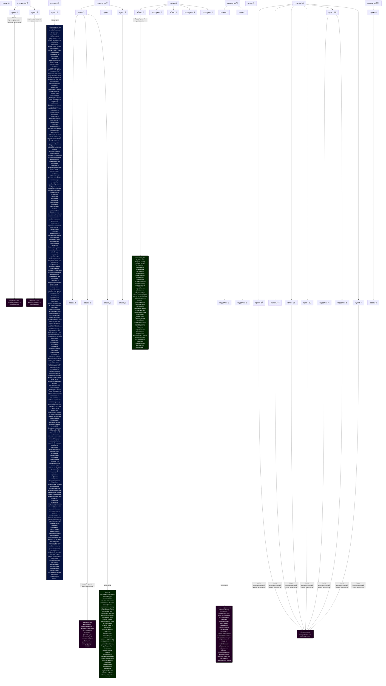

```mermaid
%%{init: { "themeVariables": {"fontSize": "20px"} } }%%
flowchart TD
17846600844774496524:::path@{ shape: rect, label: "пункт 6"}
18429131096088772881:::path@{ shape: rect, label: "статья 36<sup>44</sup>"}
17865292392741947370:::path@{ shape: rect, label: "статья 36<sup>46</sup>"}
18088683192920769449:::path@{ shape: rect, label: "статья 36<sup>41</sup>"}
12169125326425634398:::path@{ shape: rect, label: "пункт 4"}
9463416797794683719:::path@{ shape: rect, label: "статья 36<sup>12-1</sup>"}
9413429183255777923:::path@{ shape: rect, label: "пункт 5"}
10703385281207351543:::path@{ shape: rect, label: "статья 7<sup>2</sup>"}
10646252323817447632:::path@{ shape: rect, label: "статья 33"}
18429131096088772881:::path-->6119735644711532789:::path@{ shape: rect, label: "пункт 3"}
18429131096088772881:::path-->16972855573774601138:::path@{ shape: rect, label: "пункт 1"}

18429131096088772881:::path-->11111252857575115908:::path@{ shape: rect, label: "пункт 2"}
17865292392741947370:::path-->1460321643529503582:::path@{ shape: rect, label: "пункт 1"}
17865292392741947370:::path-->5787670408830595234:::path@{ shape: rect, label: "пункт 2"}
18088683192920769449:::path-->1553731966542842703:::path@{ shape: rect, label: "пункт 1"}

1553731966542842703-->|после 'единовременного взноса,' дополнить|8113270925567805819:::words@{ shape: rounded, label: "сберегательных взносов, уплаченных работодателем,"}
18088683192920769449:::path-->14179728294786690839:::path@{ shape: rect, label: "пункт 2"}

14179728294786690839-->|после 'не отражены' дополнить|6356605150174540067:::words@{ shape: rounded, label: "сберегательные взносы, уплаченные работодателем,"}
12169125326425634398:::path-->2783937189942444921:::path@{ shape: rect, label: "абзац 2"}

2783937189942444921-->|После 'пункт 7 ' дополнить: |16346444097229850220:::apply@{ shape: rounded, label: "\"За счет средств федерального бюджета и (или) резерва Фонда пенсионного и социального страхования Российской Федерации по обязательному пенсионному страхованию, направляемых на осуществление государственной поддержки формирования долгосрочных сбережений (за исключением средств Фонда национального благосостояния) в порядке, установленном Правительством Российской Федерации, может осуществляться покрытие расходов организации, определенной Правительством Российской Федерации в целях осуществления государственной поддержки формирования долгосрочных сбережений, возникающих в связи с осуществлением государственной поддержки формирования долгосрочных сбережений.\";  "}
12169125326425634398:::path-->7338661819970820040:::path@{ shape: rect, label: "подпункт 2"}

12169125326425634398:::path-->5700464664758538865:::path@{ shape: rect, label: "абзац 1"}

12169125326425634398:::path-->5789694757333977584:::path@{ shape: rect, label: "подпункт 3"}

12169125326425634398:::path-->14126236053795517543:::path@{ shape: rect, label: "подпункт 1"}

9463416797794683719:::path-->10020666083768692071:::path@{ shape: rect, label: "пункт 6"}
10703385281207351543:::path-->11866548893549593154:::path@{ shape: rect, label: "пункт 1"}

11866548893549593154-->| в редакции: |16242823649530686503:::replace@{ shape: rounded, label: "\"1. Основаниями для аннулирования лицензии являются следующие нарушения:  1) неисполнение предписания Банка России об устранении нарушения требований федеральных законов или принятых в соответствии с ними нормативных правовых актов Российской Федерации и нормативных актов Банка России, в соответствии с которыми осуществляется деятельность фонда на основании лицензии, если такое нарушение повлекло введение запрета на проведение всех или части операций, предусмотренного статьей 341 настоящего Федерального закона;  2) неоднократное в течение года неисполнение предписаний Банка России об устранении нарушений требований федеральных законов или принятых в соответствии с ними нормативных правовых актов Российской Федерации и нормативных актов Банка России, в соответствии с которыми осуществляется деятельность фонда на основании лицензии;  3) нарушение запрета Банка России на проведение операций;  4) неоднократное в течение года нарушение более чем на 15 рабочих дней сроков представления отчетов, предусмотренных федеральными законами и принятыми в соответствии с ними нормативными правовыми актами Российской Федерации и нормативными актами Банка России, в соответствии с которыми осуществляется деятельность фонда на основании лицензии;  5) однократное нарушение более чем на 15 рабочих дней сроков представления в Банк России и Фонд пенсионного и социального страхования Российской Федерации уведомлений, обязанность представления которых предусмотрена федеральными законами и принятыми в соответствии с ними нормативными правовыми актами Российской Федерации и нормативными актами Банка России, в соответствии с которыми осуществляется деятельность фонда на основании лицензии, а равно неоднократное неисполнение указанной обязанности в течение года;  6) неоднократное в течение года нарушение требований к распространению, предоставлению или раскрытию информации, предусмотренных федеральными законами и принятыми в соответствии с ними нормативными правовыми актами Российской Федерации и нормативными актами Банка России, в соответствии с которыми осуществляется деятельность фонда на основании лицензии;  7) прекращение оперативного управления деятельностью фонда (если при принятии решения о приостановлении полномочий или об освобождении от должности лица, осуществляющего функции единоличного исполнительного органа фонда, не было принято решение о назначении (избрании) лица, осуществляющего такие функции, в том числе временно);  8) распоряжение фондом средствами пенсионных накоплений с нарушением требований, предусмотренных настоящим Федеральным законом, или самостоятельное размещение средств пенсионных резервов в объекты, не предназначенные для самостоятельного размещения;  9) осуществление деятельности, не предусмотренной статьей 2 настоящего Федерального закона, в том числе производственной или торговой деятельности;  10) неисполнение предписания Банка России об устранении нарушений, связанных с организацией инвестирования средств пенсионных накоплений, в том числе требований абзаца второго пункта 1 статьи 3612 и пункта 3 статьи 3613 настоящего Федерального закона;  11) неоднократное в течение одного года неисполнение специальных экономических мер, предусмотренных статьей 31 Федерального закона от 30 декабря 2006 года № 281-ФЗ \"О специальных экономических мерах и принудительных мерах\", и (или) неоднократное в течение одного года нарушение требований нормативных актов Банка России, изданных в соответствии с указанным Федеральным законом;  12) неоднократное в течение года нарушение фондом требований к выявлению конфликта интересов и управлению конфликтом интересов, предусмотренных настоящим Федеральным законом и принятыми в соответствии с ним нормативными актами Банка России (далее также - требования к выявлению конфликта интересов и управлению конфликтом интересов).\";  а) абзац восемнадцатый после слов \"единовременного взноса,\" дополнить словами \"сберегательных взносов, уплаченных работодателем,\";  б) дополнить абзацем девятнадцатым следующего содержания:  \"предоставлять администратору софинансирования информацию о назначении участнику выплаты по договору долгосрочных сбережений или об осуществлении выплаты выкупной суммы по договору долгосрочных сбережений, если это влечет за собой прекращение права на получение государственной поддержки формирования долгосрочных сбережений в соответствии с пунктом 3 статьи 3644 настоящего Федерального закона.\";  "}
10646252323817447632:::path-->14570887563043317912:::path@{ shape: rect, label: "пункт 8<sup>1</sup>"}

14570887563043317912-->|после 'единовременный взнос' дополнить|10480381480345130608:::words@{ shape: rounded, label: ", сберегательные взносы, уплаченные работодателем,"}
10646252323817447632:::path-->8755186228454951244:::path@{ shape: rect, label: "пункт 14<sup>1</sup>"}

8755186228454951244-->|после 'единовременный взнос' дополнить|10480381480345130608:::words@{ shape: rounded, label: ", сберегательные взносы, уплаченные работодателем,"}
10646252323817447632:::path-->586772963041116207:::path@{ shape: rect, label: "пункт 36"}

586772963041116207-->|после 'единовременный взнос' дополнить|10480381480345130608:::words@{ shape: rounded, label: ", сберегательные взносы, уплаченные работодателем,"}
10646252323817447632:::path-->7029148759831305627:::path@{ shape: rect, label: "пункт 50"}

7029148759831305627-->|после 'единовременный взнос' дополнить|10480381480345130608:::words@{ shape: rounded, label: ", сберегательные взносы, уплаченные работодателем,"}
10646252323817447632:::path-->16799842714602176050:::path@{ shape: rect, label: "пункт 10"}
10646252323817447632:::path-->10490608831106411835:::path@{ shape: rect, label: "пункт 7"}

10490608831106411835-->|после 'единовременный взнос' дополнить|10480381480345130608:::words@{ shape: rounded, label: ", сберегательные взносы, уплаченные работодателем,"}
6119735644711532789:::path-->2547044091211878432:::path@{ shape: rect, label: "абзац 1"}

6119735644711532789:::path-->12010354689665046019:::path@{ shape: rect, label: "абзац 2"}

12010354689665046019-->|после 'в другой фонд' дополнить|7878931868548463197:::words@{ shape: rounded, label: ", выкупных сумм, выплаченных правопреемникам, а также выкупных сумм, полученных по договорам долгосрочных сбережений, по которым не были уплачены дополнительные стимулирующие взносы"}
6119735644711532789:::path-->4418627510696379848:::path@{ shape: rect, label: "абзац 3"}

4418627510696379848-->| дополнить: |6278926600623134607:::apply@{ shape: rounded, label: "\"В случае прекращения договора долгосрочных сбережений (за исключением случая расторжения договора долгосрочных сбережений в связи с переводом выкупной суммы в другой фонд) до 1 апреля года, следующего за годом, в котором вкладчик - физическое лицо уплатил первый сберегательный взнос по указанному договору, право на получение государственной поддержки формирования долгосрочных сбережений по указанному договору не предоставляется. В этом случае ранее произведенная уплата сберегательных взносов по прекращенному договору долгосрочных сбережений не влечет начала течения срока государственной поддержки формирования долгосрочных сбережений, предусмотренного абзацем первым пункта 2 настоящей статьи.\";  "}
11111252857575115908:::path-->15043315468688926083:::path@{ shape: rect, label: "абзац 1"}

1460321643529503582:::path-->13139778616924597067:::path@{ shape: rect, label: "подпункт 3"}

13139778616924597067-->|дополнить|13994596716947347965:::words@{ shape: rounded, label: ", а также информацию о прекращении у вкладчика - физического лица права на получение государственной поддержки формирования долгосрочных сбережений в соответствии со статьей 3644 настоящего Федерального закона в связи с окончанием срока осуществления государственной поддержки формирования долгосрочных сбережений или наступлением события, предусмотренного абзацем вторым пункта 3 статьи 3644 настоящего Федерального закона"}
5787670408830595234:::path-->7793174850376789593:::path@{ shape: rect, label: "подпункт 1"}

10020666083768692071:::path-->4981173314531731288:::path@{ shape: rect, label: "абзац 5"}

16799842714602176050:::path-->9024986490215541785:::path@{ shape: rect, label: "подпункт 4"}

9024986490215541785-->|после 'единовременный взнос' дополнить|10480381480345130608:::words@{ shape: rounded, label: ", сберегательные взносы, уплаченные работодателем,"}
16799842714602176050:::path-->17464029034524858302:::path@{ shape: rect, label: "подпункт 6"}

17464029034524858302-->|после 'единовременный взнос' дополнить|10480381480345130608:::words@{ shape: rounded, label: ", сберегательные взносы, уплаченные работодателем,"}

classDef replace fill:#061341,stroke:#333,stroke-width:4px,color:white,font-size:18px
classDef apply fill:#022400,stroke:#333,stroke-width:4px,color:white,font-size:18px
classDef words fill:#230024,stroke:#333,stroke-width:4px,color:white,font-size:18px
classDef path font-size:28px
```