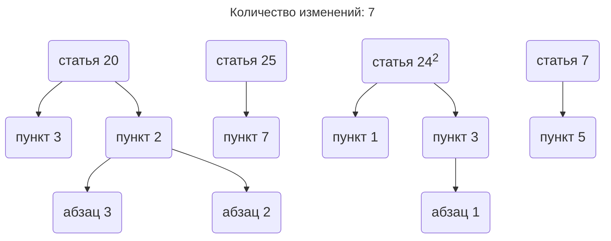

```mermaid

---
title: "Количество изменений: 7"
---
%%{init: { "themeVariables": {"fontSize": "20px"} } }%%
flowchart TD
3565391270261261817@{ shape: rounded, label: "статья 20"}
14901943633444308844@{ shape: rounded, label: "статья 25"}
5789347710849047716@{ shape: rounded, label: "статья 24<sup>2</sup>"}
1979050971250297935@{ shape: rounded, label: "статья 7"}
16143883374197144674@{ shape: rounded, label: "пункт 3"}
9848673957220412147@{ shape: rounded, label: "пункт 2"}
7764664368912257084@{ shape: rounded, label: "пункт 7"}
8226247985376750520@{ shape: rounded, label: "пункт 1"}
6997219601169200219@{ shape: rounded, label: "пункт 3"}
14878299222897915143@{ shape: rounded, label: "пункт 5"}
5835380115315909074@{ shape: rounded, label: "абзац 3"}
7043015201645621386@{ shape: rounded, label: "абзац 2"}
5597613885198291469@{ shape: rounded, label: "абзац 1"}
3565391270261261817 --> 16143883374197144674
3565391270261261817 --> 9848673957220412147
14901943633444308844 --> 7764664368912257084
5789347710849047716 --> 8226247985376750520
5789347710849047716 --> 6997219601169200219
1979050971250297935 --> 14878299222897915143
9848673957220412147 --> 5835380115315909074
9848673957220412147 --> 7043015201645621386
6997219601169200219 --> 5597613885198291469

classDef replace fill:#061341,stroke:#333,stroke-width:4px,color:white,font-size:18px
classDef apply fill:#022400,stroke:#333,stroke-width:4px,color:white,font-size:18px
classDef words fill:#230024,stroke:#333,stroke-width:4px,color:white,font-size:18px
classDef path font-size:28px
```